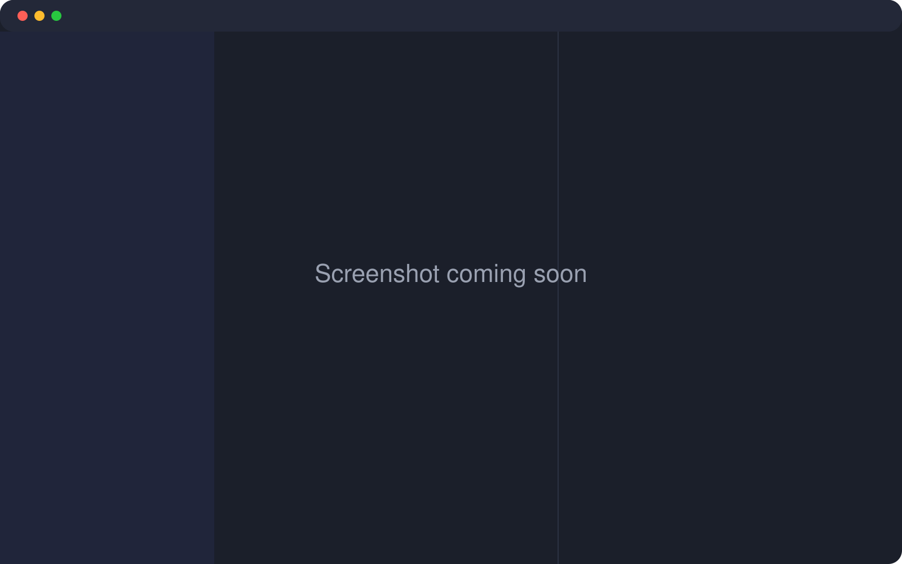

<p align="center">
  
</p>

<h1 align="center">LightMD</h1>

<p align="center">A small, local-only Markdown and HTML reader and editor for macOS and Linux.</p>

<p align="center">
  
</p>

LightMD opens a folder of `.md` and `.html` files and shows each one as an editor next to a live preview. Your files stay plain files on your disk. There's no account, no cloud and no telemetry.

It's built with [Tauri 2](https://v2.tauri.app/), so it uses the system webview (WKWebView on macOS, WebKitGTK on Linux) rather than bundling a browser.

## Features

- **Editor and live preview** side by side, with frontmatter shown as a small table
- **Tabs** for open files, each with its own undo history
- **Outline** of the document's headings; click one to jump the editor and preview there
- **Scroll sync** between editor and preview
- **Find** in the open file, and **search across the folder**
- **Recent folders**, and opening a folder or file **from the command line** (`lightmd .`)
- **Live reload**: files changed by another program (git, another editor) update on screen
- **Crash-safe autosave**: a crash or full disk can't leave a file empty, and changes made elsewhere are never silently overwritten
- **HTML files** open in a sandboxed viewer; their JavaScript is off unless you turn it on for that file
- **Themes**, adjustable fonts and pane layout, all remembered between launches

## Install

### Download

Get the latest build from the [Releases page](https://github.com/RyanEmslie/lightmd/releases/latest):

- **macOS** (Apple silicon and Intel): `LightMD_<version>_universal.dmg`. Open it and drag LightMD into Applications.
- **Linux**: the `.deb` for Debian and Ubuntu (`sudo apt install ./LightMD_<version>_amd64.deb`), the `.rpm` for Fedora, or the `.AppImage`, which runs anywhere (`chmod +x` it first).

The macOS build isn't signed with an Apple Developer ID yet, so macOS blocks it the first time. To open it, either:

- try to open LightMD, then go to **System Settings → Privacy & Security** and click **Open Anyway**, or
- run `xattr -dr com.apple.quarantine /Applications/LightMD.app` once in Terminal.

### Build from source

Building takes a few minutes the first time.

#### 1. Install the prerequisites

**macOS**

- Xcode Command Line Tools: `xcode-select --install`. The full Xcode app isn't needed, and neither is an Apple Developer account; signing and notarization aren't required to build and run locally.
- Node.js 20 or newer, with npm
- Rust stable, installed with [rustup](https://rustup.rs/):

  ```sh
  curl --proto '=https' --tlsv1.2 -sSf https://sh.rustup.rs | sh
  . "$HOME/.cargo/env"
  rustup default stable
  ```

**Linux** (Debian / Ubuntu)

- Node.js 20 or newer, with npm
- Rust stable, installed with [rustup](https://rustup.rs/) as shown above. Debian's packaged `rustc` is too old for Tauri 2, so don't use the distro package.
- The WebKitGTK 4.1 and GTK 3 development packages:

  ```sh
  sudo apt update
  sudo apt install libwebkit2gtk-4.1-dev \
    build-essential \
    curl \
    wget \
    file \
    libxdo-dev \
    libssl-dev \
    libayatana-appindicator3-dev \
    librsvg2-dev \
    pkg-config
  ```

For Fedora, Arch and other distributions, see [Tauri's Linux prerequisites](https://v2.tauri.app/start/prerequisites/#linux).

#### 2. Build

```sh
git clone https://github.com/RyanEmslie/lightmd
cd lightmd
npm install
npm run tauri build
```

#### 3. Install the app

The build writes the app to `src-tauri/target/release/bundle/`.

**macOS:** drag `bundle/macos/LightMD.app` into `/Applications`. A `.dmg` is also written to `bundle/dmg/`.

**Linux:** install the `.deb`, or run the AppImage directly:

```sh
sudo apt install ./src-tauri/target/release/bundle/deb/*.deb
# or
./src-tauri/target/release/bundle/appimage/*.AppImage
```

#### 4. Add the `lightmd` command (optional)

The `.deb` already puts `lightmd` on your `PATH`. Otherwise, link it once:

```sh
# macOS
ln -s /Applications/LightMD.app/Contents/MacOS/lightmd /usr/local/bin/lightmd
# Linux, running from the build folder
ln -s "$PWD/src-tauri/target/release/lightmd" ~/.local/bin/lightmd
```

## Update

If you installed a download, get the new version from the [Releases page](https://github.com/RyanEmslie/lightmd/releases/latest) and install it over the old one.

If you built from source, from your clone:

```sh
git pull
npm install
npm run tauri build
```

Then install the new build the same way as before: replace `LightMD.app` in `/Applications`, or install the new `.deb`. Your settings, recent folders and last session are kept. See the [changelog](CHANGELOG.md) for what changed.

## Usage

Click **Open Folder** (or press Cmd/Ctrl+O) and choose a folder. LightMD lists the `.md`, `.html` and `.htm` files in it and its subfolders. Click a file to open it in a tab.

Edits save automatically after a short pause; you can change the delay, or turn autosave off, in Settings. The tab and the status bar mark files with unsaved changes.

### From the command line

```sh
lightmd .            # open this folder
lightmd notes/       # open another folder
lightmd README.md    # open the file's folder, with the file open
```

Without a path, LightMD reopens your last folder and file. Each run opens a new window.

### Keyboard shortcuts

macOS uses Cmd; Linux uses Ctrl.

| Action | Shortcut |
|---|---|
| Open folder | Cmd/Ctrl+O |
| Save | Cmd/Ctrl+S |
| Save As | Cmd/Ctrl+Shift+S |
| Find in file | Cmd/Ctrl+F |
| Show or hide the explorer, editor, preview | Cmd/Ctrl+1, 2, 3 |
| Previous or next theme | Cmd/Ctrl+Alt+← / → |
| Undo, redo | Cmd/Ctrl+Z, Cmd/Ctrl+Shift+Z |

## Privacy

LightMD works entirely on your machine:

- There's no telemetry, no account and no update check.
- It only reads and writes files in the folder you open, plus any file you save elsewhere with Save As.
- Settings, recent folders and your last session are stored locally by the system webview.
- Links to websites open in your browser, and only when you click them.
- The Markdown preview doesn't load remote images. HTML files open in a sandboxed frame that blocks remote images, stylesheets, fonts, media, frames and form posts.
- JavaScript in an HTML file is off by default. Turning it on applies only to that file until you switch files or restart, is never saved, and still can't load anything remote.

## Development

```sh
npm install
npm run tauri dev      # run the app with live rebuilds of the Rust side
npm run bundle         # rebuild src/editor.bundle.js after editing src/*.js
```

Tests:

```sh
npm run test:js        # unit and app tests (Node, fake DOM and backend)
npm run test:e2e       # the real app in WebKit via Playwright
npm run test:rust      # Rust backend tests
```

The first `test:e2e` run may need the browser: `npx playwright install webkit`.

Project layout:

- `src/index.html` holds the markup, styles and app glue (explorer, tabs, saving).
- `src/*.js` are the editor, preview, layout, settings and other modules, bundled into `src/editor.bundle.js`.
- `src-tauri/` is the Rust backend; file access goes through `src-tauri/src/lib.rs`, which keeps every path inside the opened folder.
- `tests/` has the Node tests; `tests/e2e/` has the WebKit tests.

To change the app icon, edit `src-tauri/icons/icon.svg` and run `npx tauri icon src-tauri/icons/icon.svg`.

## Changelog

See [CHANGELOG.md](CHANGELOG.md).

## License

[MIT](LICENSE)
